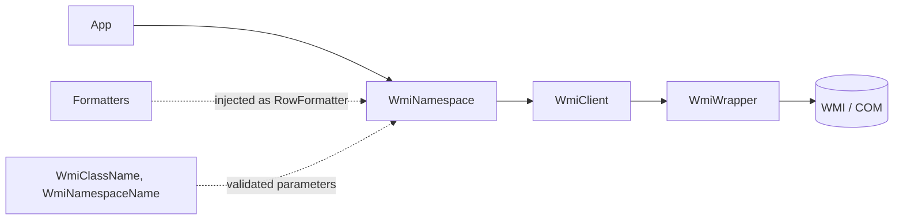

# wmi-query

C++23 library for querying Windows Management Instrumentation (WMI). Pick a WMI
class and the properties you need, run the query, and read the results back as
strings. Includes standalone formatters for WMI dates and byte/decimal sizes
that you plug in per property.

## Features

- Thin RAII wrapper over the WMI COM interfaces (`IWbemLocator`,
  `IWbemServices`, `IEnumWbemClassObject`).
- Class-based interface: one `WmiNamespace` object per WMI class and property
  list. It can be queried repeatedly.
- Values are returned as `std::wstring` (or `int`), so callers never touch
  `VARIANT`.
- Runtime failures (COM, connection, query) degrade to empty results instead of
  throwing, so display code stays simple.
- Class and namespace names are validated types. An invalid name is a
  programmer error, so it throws `std::invalid_argument` when the name is
  constructed and can never reach a query.
- Formatters are plain functions from text to text, independent of WMI. Inject
  them per property at construction, or use them on their own. Built in:
  `DD.MM.YYYY` dates, B/KB/MB to human-readable binary units, and decimal
  (x1000) units.
- A failed `Connect()` is rolled back with an RAII guard, and a failed
  `Initialize()` leaves nothing initialized, so no half-built COM state is left
  behind.
- Clean under `clang-tidy` with warnings treated as errors.

## Requirements

- Windows 10 or later.
- A C++23 compiler (developed with MSVC and clang-tidy).
- Links against `wbemuuid.lib` (already requested via `#pragma comment`).
- `scope.hpp`: the RAII guards (`amitgdev::scope_exit` and friends) come from
  shared infrastructure code, not from this library. `WmiWrapper.cpp` needs it
  on the include path.

## Layout

| File | Role |
| --- | --- |
| `WmiWrapper` | COM and WMI adapter. The only class that touches COM, BSTR and VARIANT. Reports failures as `HRESULT`s and rolls back partial setup. |
| `WmiClient` | Session. Connects to a WMI namespace and runs queries over that one connection. The single place where a runtime failure becomes an empty result. |
| `WmiNamespace` | Public facade. Holds the WMI class, property list and formatters, caches the last result, and provides lookup and formatting helpers. |
| `ValidatedString` | Template for a `std::wstring` that is valid by construction. Each validation rule gives a distinct type. |
| `WmiClassName`, `WmiNamespaceName` | Validated types for the two names that reach WMI (see below). Literals convert implicitly. |
| `Formatters` | Standalone formatting functions (`FormatDate`, `FormatB`, `FormatKB`, `FormatMB`, `FormatDecimal`). No WMI dependency; `WmiNamespace` does not include them, so include `Formatters.hpp` only where you use them. |



## Quick start

Add the files in `src/` to your project, then:

```cpp
#include <iostream>
#include <variant>

#include "WmiNamespace.hpp"
#include "WmiWrapper.hpp"
#include "scope.hpp"

int main() {
  // Once per process, before any query. A failure leaves nothing to undo.
  if (FAILED(amitgdev::WmiWrapper::Initialize())) {
    return 1;
  }

  // Balances Initialize() on every exit path.
  const amitgdev::scope_exit cleanup_guard{
      [] noexcept { amitgdev::WmiWrapper::Uninitialize(); }};

  amitgdev::WmiNamespace time_zone(
      L"Win32_TimeZone", {L"Bias", L"DaylightName", L"Description"});

  time_zone.Query();  // Can be called again to refresh.

  // One column per returned WMI object.
  for (const auto& column : time_zone.Data()) {
    for (const auto& [name, value] : column) {
      if (const auto* text = std::get_if<std::wstring>(&value)) {
        std::wcout << name << L" : " << *text << L'\n';
      }
    }
  }
}  // time_zone is destroyed before the guard runs, so WMI objects are released
   // before COM is torn down.
```

`WmiNamespace` defaults to the `ROOT\CIMV2` namespace. Pass the namespace as the
first argument to use another one:

```cpp
amitgdev::WmiNamespace defender(L"ROOT\\Microsoft\\Windows\\Defender",
                                L"MSFT_MpComputerStatus", {L"AMServiceEnabled"});
```

### Class and namespace names

The class name is placed into the WQL text and the namespace name selects what
`ConnectServer` reaches, so both are validated types instead of plain strings.
Validation happens once, in the constructor: an invalid value throws
`std::invalid_argument` and cannot exist, so no other code re-checks it.

| Type | Accepted | Refused |
| --- | --- | --- |
| `WmiClassName` | A letter, then letters, digits or underscore: `Win32_TimeZone` | Empty text, a leading digit or underscore (so system classes such as `__Namespace`), spaces, quotes, anything else |
| `WmiNamespaceName` | Names separated by single backslashes, each following the class-name rule: `ROOT\CIMV2` | Empty text, a leading, trailing or doubled backslash, remote forms such as `\\server\root` |

Wide string literals convert implicitly, so the examples above read as plain
text. A runtime `std::wstring` needs the explicit form:

```cpp
const std::wstring name = ReadClassNameFromConfig();
amitgdev::WmiNamespace Query(amitgdev::WmiClassName{name}, {L"Description"});
```

The exception text states the rule but not the value, because the value is
arbitrary caller text. A bad literal fails at construction, before any COM call.

### Reading all results

`Data()` returns every row of every returned object: a list of columns, each
a list of `(property name, value)` pairs. The reference stays valid until the
next `Query()`.

```cpp
amitgdev::WmiNamespace serial_ports(L"Win32_SerialPort",
                                    {L"Description", L"DeviceID"});
serial_ports.Query();

for (const auto& column : serial_ports.Data()) {
  for (const auto& [name, value] : column) {
    if (const auto* text = std::get_if<std::wstring>(&value)) {
      std::wcout << name << L" : " << *text << L'\n';
    }
  }
}
```

### Formatting values

A formatter turns the text of one property into display text. Pass a list of
`RowFormatter`s as the last constructor argument. They run after every
`Query()`, in list order, on that property in every returned object:

```cpp
#include "Formatters.hpp"

amitgdev::WmiNamespace os(
    L"Win32_OperatingSystem",
    {L"Caption", L"InstallDate", L"TotalVisibleMemorySize"},
    {
        {.row_title = L"InstallDate", .format = amitgdev::FormatDate},
        {.row_title = L"TotalVisibleMemorySize", .format = amitgdev::FormatKB},
    });
os.Query();  // Data() already holds the formatted values.
```

| Formatter | Input | Output example |
| --- | --- | --- |
| `FormatDate` | WMI datetime (`YYYYMMDD...`) | `04.10.2026` |
| `FormatB`, `FormatKB`, `FormatMB` | Size in bytes, KB or MB (digits only) | `16G`, `512` (plain bytes have no suffix), `512K` |
| `FormatDecimal` | Value in mega units, such as a clock speed in MHz | `2400` -> `2.4G`, `800` -> `800M` |

Notes on the formatters:

- Sizes are scaled by integer division, so they are truncated, not rounded:
  `1536` bytes becomes `1K`.
- Input that a formatter cannot parse is returned unchanged. For the size
  formatters that means anything that is not a plain digit string. `FormatDate`
  only checks the length: input shorter than 8 characters is returned
  unchanged, anything longer is cut by position, so apply it only to WMI
  datetime properties.
- `Format1024` and `Format1000` are the common scalers behind the specialized
  formatters. Use them directly for another input unit.

Write your own formatter as any callable that takes the text and returns the
text. It knows nothing about WMI, so a free function, a lambda or a functor all
work. It takes the text by value or by `const&`, and may return the input
unchanged as a fallback:

```cpp
// Intent: keep the raw code when it is unknown, so no information is lost.
std::wstring FormFactorName(std::wstring code) noexcept {
  return code == L"8" ? L"DIMM" : code;
}

amitgdev::WmiNamespace memory(
    L"Win32_PhysicalMemory", {L"Capacity", L"FormFactor"},
    {
        {.row_title = L"Capacity", .format = amitgdev::FormatB},
        {.row_title = L"FormFactor", .format = FormFactorName},
    });
```

A formatter for a property that is not in the property list has no effect. A
cell that does not hold a string, or whose formatter throws, is skipped and
keeps its original value.

To format ad hoc, outside the constructor list, call the static
`WmiNamespace::ConvertRow` on a copy of the data. `Data()` is read-only:

```cpp
amitgdev::Columns data = os.Data();
amitgdev::WmiNamespace::ConvertRow(data, L"Caption", MyFormatter);
```

## Behavior notes

- **COM lifetime.** `WmiWrapper::Initialize()` and `Uninitialize()` are static.
  COM initialization is per thread, so every successful `Initialize()` must be
  balanced by one `Uninitialize()` on the same thread, calls can nest, and every
  thread that uses the library needs its own pair. Every `WmiNamespace` and
  `WmiClient` must be destroyed before the last `Uninitialize()`.
- **Repeated `Initialize()` is fine.** COM security can be set only once per
  process. If it was already set (by an earlier call or by the host
  application), that is accepted and the earlier setting stays; each connection
  sets its own proxy security, so queries still work.
- **Setup is atomic.** A failed `Initialize()` leaves nothing initialized, and a
  failed `Connect()` leaves the wrapper disconnected.
- **Runtime failures are quiet at the top.** If COM, the connection, or the
  query fails, `Query()` returns 0 and `Data()` is empty. `WmiWrapper` itself
  returns `HRESULT`s, and you can check `Initialize()` yourself.
- **Invalid names throw.** A class or namespace name that breaks its rule throws
  `std::invalid_argument` at construction, before any query. Out of memory
  throws `std::bad_alloc` as usual.
- **Supported property types.** Strings, integers (including unsigned 32-bit
  values and 8 and 16-bit integers) and booleans (printed as `0` or `1`). Real
  numbers, arrays, null and other types map to an empty string.
- **Single pass.** Each `Query()` fetches the full result set into memory, so
  repeated reads use the cached data.
- **Non-copyable.** `WmiNamespace` and `WmiWrapper` own COM pointers and cannot
  be copied or moved.

## Extending

`WmiNamespace` has a virtual destructor, so you can derive from it to give a
query typed accessors. The protected `GetAt(pos, row_title)` returns one cell as
a string, or an empty string when the cell is missing or not a string:

```cpp
class TimeZone final : public amitgdev::WmiNamespace {
 public:
  TimeZone() : WmiNamespace(L"Win32_TimeZone", {L"Bias", L"Description"}) {}

  // Row 0 is the first returned WMI object.
  [[nodiscard]] std::wstring Description() const {
    return GetAt(0, L"Description");
  }
};
```

The static helpers (`GetRowIndex`, `ConvertRow`) and the formatters are also
available to classes that combine several WMI queries; see the next section.

Another validated string is a few lines: write a rule with a static
`IsValid(std::wstring_view)` and a `kRequirement` text, then alias
`ValidatedString<YourRule>`. `WmiClassName` is the reference.

## Multi-query (dependent queries)

When one query's result feeds the next (a drive, then its partitions, then their
logical drives), use `WmiClient` directly instead of `WmiNamespace`. One client
keeps one connection for the whole chain, and `Query()` returns the same
`Columns` type, so the static helpers still apply.

```cpp
#include "WmiClient.hpp"
#include "WmiNamespace.hpp"

// Value of one property in a Column, or an empty string.
std::wstring ValueAt(const amitgdev::Column& column, const std::wstring& name) {
  const size_t index = amitgdev::WmiNamespace::GetRowIndex(column, name);
  if (index == SIZE_MAX) {
    return {};
  }

  const auto* text = std::get_if<std::wstring>(&column.at(index).second);
  return text != nullptr ? *text : std::wstring{};
}

amitgdev::WmiClient client(L"ROOT\\CIMV2");  // One connection for every query.

// Query 1: the physical drives.
const amitgdev::Columns drives =
    client.Query(L"SELECT * FROM Win32_DiskDrive", {L"DeviceId", L"Model"});

for (const auto& drive : drives) {
  // Query 2: this drive's partitions. The device ID comes from WMI itself and
  // goes into the query text as received.
  const amitgdev::Columns partitions = client.Query(
      L"ASSOCIATORS OF {Win32_DiskDrive.DeviceID='" +
          ValueAt(drive, L"DeviceId") +
          L"'} WHERE AssocClass=Win32_DiskDriveToDiskPartition",
      {L"DeviceId"});

  // ... Query 3 repeats the pattern for each partition.
}
```

`Example 4` in `main.cpp` is the complete version. A small `Drives` class wraps
the three levels, keeps each physical drive together with its logical drives,
and exposes `Data()` and `GetTotalSize()`. Its results are printed with the same
`Print` used for single queries, and the total is shown with `FormatB`.

Notes:

- **No query-text validation.** `WmiClient` validates the namespace name it
  connects to, but not the query text, unlike `WmiNamespace`, whose class name
  is a validated type. The sample above only feeds WMI-provided device IDs back
  into follow-up queries. Never put untrusted text into a query string.
- **A failed level gives an empty result.** If a query fails or finds nothing,
  `Query()` returns an empty `Columns`, so the next level simply has nothing to
  iterate over.
- **Partitions without a drive letter do not appear.**
  `Win32_LogicalDiskToPartition` only links partitions that have a logical
  drive, so EFI and recovery partitions are missing from the third level.
- **Work on copies to format.** `ConvertRow` takes a non-const `Columns&`, so
  copy the data before formatting it for display.

## License

MIT. See the license header in each source file.
